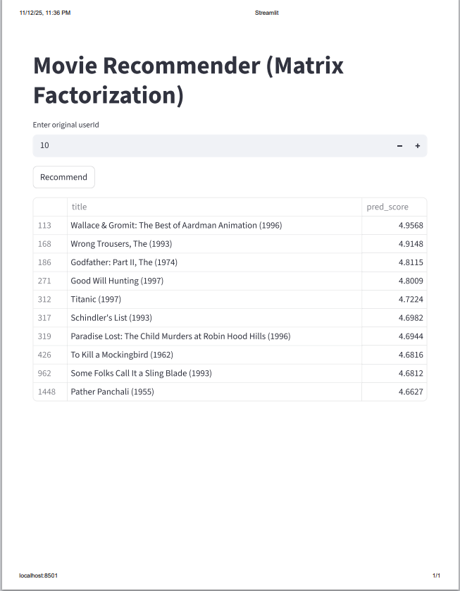

# 🎬 Movie Recommender — Matrix Factorization (From Scratch)

A clean, portfolio-ready implementation of a Matrix Factorization-based movie recommender trained on MovieLens-100K. Includes from-scratch SGD optimization, user/item biases, evaluation, hyperparameter tuning, and latent-factor visualization (PCA & t-SNE). Comes with polished notebooks and a Streamlit demo for interactive recommendations.

---

## 📸 Quick Demo / Screenshot



---

## 🚀 Key Features

- Matrix Factorization built from scratch using NumPy  
- User & item bias terms included  
- Stochastic Gradient Descent (SGD) optimizer  
- Train/Validation RMSE tracking  
- Hyperparameter tuning (grid search)  
- Latent factor visualization (PCA & t-SNE)  
- Interactive Streamlit demo app  
- Modular and clean code inside `src/`  

---

## 📝 Resume-Ready Summary

**One-liner:**  
Built a Matrix Factorization movie recommender from scratch (NumPy) on MovieLens-100K with SGD, hyperparameter tuning, PCA/t-SNE visualization, and a Streamlit demo.

**Two-liner:**  
Implemented a complete Matrix Factorization recommender using NumPy with SGD optimization, user/item biases, and RMSE-based validation. Developed hyperparameter tuning pipelines, latent-factor visualizations, and an interactive Streamlit interface with modular code and well-documented notebooks.

---

## 📚 Table of Contents

- [Quick Demo / Screenshot](#-quick-demo--screenshot)
- [Key Features](#-key-features)
- [Installation](#-installation)
- [Usage](#-usage)
- [Notebooks](#-notebooks)
- [Project Structure](#-project-structure)
- [Implementation Notes](#-implementation-notes)
- [Presentation Tips](#-presentation-tips)
- [Contributing](#-contributing)
- [Contact](#-contact)

---

## 🔧 Installation

### Requirements
- Python 3.8+
- Recommended: virtual environment

### Setup
```bash
git clone https://github.com/punith624/movie-recommender.git
cd movie-recommender

python -m venv venv
.\venv\Scripts\activate

pip install -r requirements.txt


▶️ Usage
1️⃣ Train the model
python main.py --train --k 30 --lr 0.007 --reg 0.02 --epochs 30

2️⃣ Launch the Streamlit app
streamlit run app.py


Open the browser:
👉 http://localhost:8501

3️⃣ Run notebooks

Open the .ipynb files in the notebooks/ directory.

📘 Notebooks
Notebook	Description
01_professional_notebook.ipynb	Full walkthrough: math, EDA, MF training, evaluation
02_hyperparam_tuning.ipynb	Grid search for k, learning rate, regularization
03_latent_viz.ipynb	PCA & t-SNE visualization of latent factors
🗂 Project Structure
movie-recommender/
├── assets/
│   └── demo.png
├── data/
├── models/
├── notebooks/
├── src/
│   ├── data_loader.py
│   ├── matrix_factorization.py
│   ├── recommend.py
│   └── evaluation.py
├── main.py
├── app.py
├── requirements.txt
└── README.md

🧠 Implementation Notes

Matrix Factorization model:

𝑟
^
𝑢
𝑖
=
𝜇
+
𝑏
𝑢
+
𝑏
𝑖
+
𝑝
𝑢
⊤
𝑞
𝑖
r
^
ui
	​

=μ+b
u
	​

+b
i
	​

+p
u
⊤
	​

q
i
	​


Optimization: SGD with L2 regularization

Evaluation: RMSE on train + validation

Visualization: PCA (global structure), t-SNE (local grouping)

🎨 Presentation Tips

Show RMSE curves for model quality

Explain MF formula: global mean + biases + latent dot product

Present Top-N recommendations for common users

Show PCA/t-SNE scatterplots grouped by movie genres

Mention training time (approx. 3 minutes on MovieLens-100K)

Highlight modular code design in src/

📄 .gitignore (Recommended)
venv/
__pycache__/
*.pyc
data/
models/
.env

🤝 Contributing

Feel free to open issues or submit pull requests!

📬 Contact

Punith Kumar
GitHub: https://github.com/punith624

Email: kumarpunith6864@gmail.com
